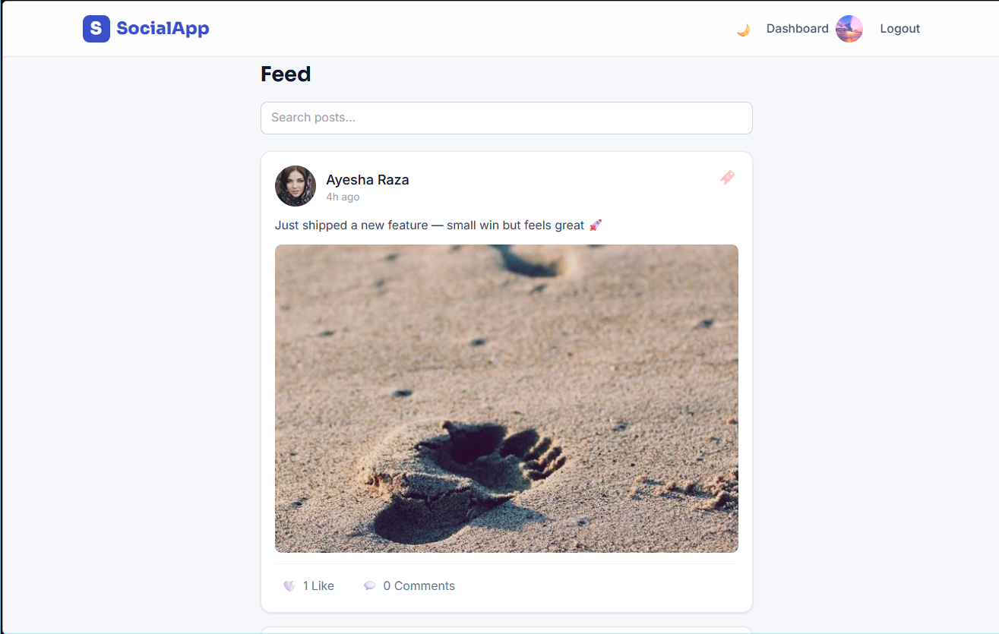
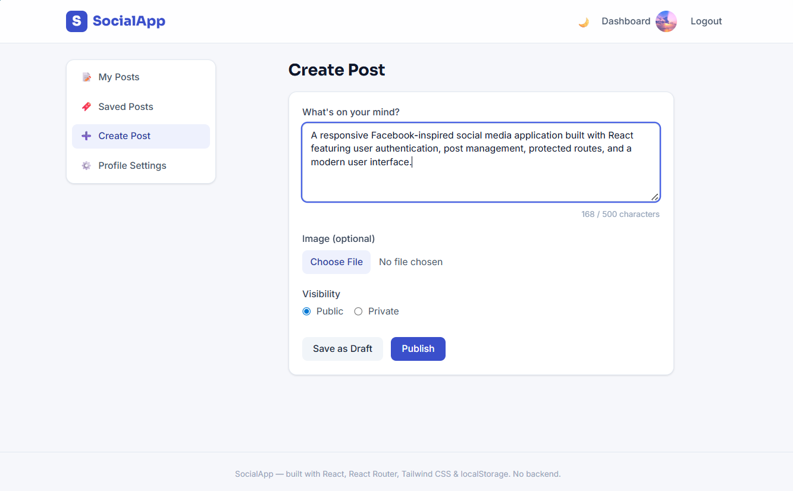
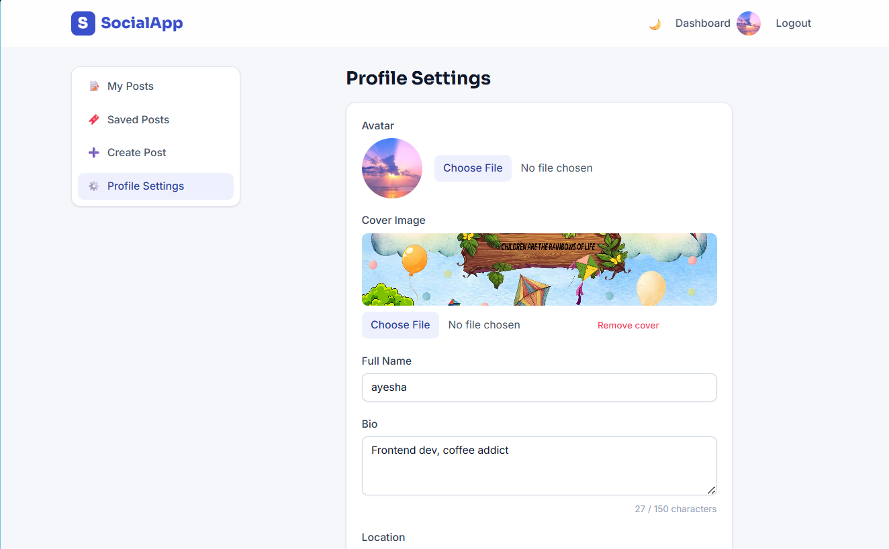
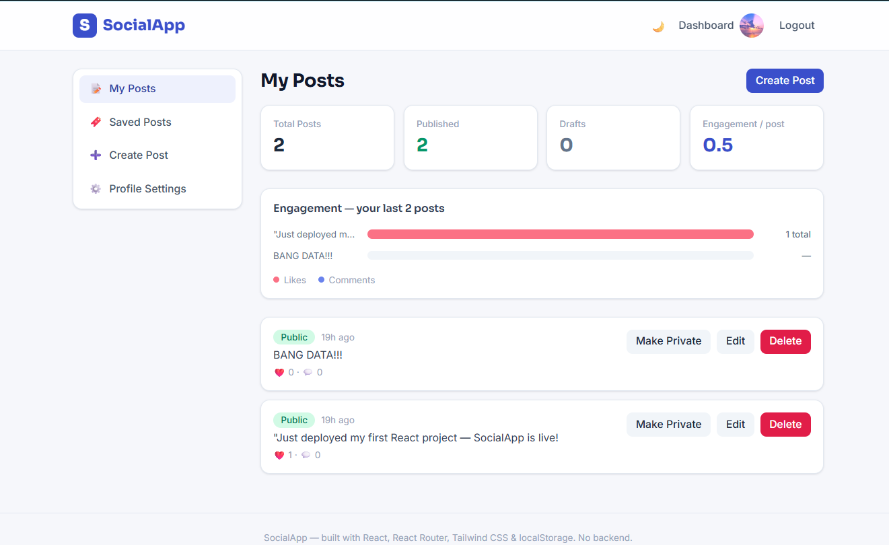

# SocialApp

A Facebook-inspired social media platform built with React — sign up, post updates with images, like, comment, and manage everything from a personal dashboard, all running entirely on `localStorage`.

## Live Demo

🔗 [SocialApp Live Demo](https://social-app-ayesha-zaman-ld68.vercel.app)

## Screenshots

### Feed Page


### Create Post


### Profile Page


### Dashboard


## Tech Stack

- **React (Vite)** — frontend framework and build tool
- **React Router v6** — client-side routing, dynamic routes, protected routes
- **Tailwind CSS** — utility-first styling, responsive design, dark mode (`class` strategy)
- **React Hook Form** — all form handling and validation (login, signup, post creation, profile settings)
- **Context API** — global auth state (`AuthContext`)
- **localStorage** — the only data store: users, posts, comments, likes
- **clsx** — conditional className composition for component variants
- **React.lazy + Suspense** — route-based code splitting, each page loads on demand

No backend, no Firebase, no Supabase, no external database, and no UI component libraries (Bootstrap/MUI/AntD) were used — this is a pure frontend project.

## Features

**Auth**
- Sign up with full name, email, and password (validated: min 8 chars, 1 uppercase, 1 number, confirm password match)
- Login with email + password, inline error on invalid credentials
- Session persists across page refresh via `localStorage`
- Logout clears the session

**Feed**
- Public feed showing all published, public posts — newest first
- Guests can view the feed and posts, but liking/commenting redirects to `/login` with a contextual message
- Empty state when there are no public posts yet
- **Bonus:** live search filters posts by description as you type
- **Bonus:** "Load demo data" link on the login page seeds 5 sample users, 8 posts, and cross-user likes/comments with real photos, for quick demoing — uses the same `storage.js` functions as everything else, so it's optional and never runs on its own
- **Bonus:** engagement chart on the dashboard (custom SVG, no chart library) showing likes/comments per recent post
- **Bonus:** stat cards at the top of the dashboard — total posts, published, drafts, and an engagement-per-post score, all derived live from localStorage

**Posts**
- Create posts with a description, optional image upload (with live preview), and Public/Private visibility
- Save as Draft or Publish directly
- Live character counter on the description (amber at 400, red at 480, disabled at 500+)
- Edit any of your own posts — description, image, and visibility
- Delete posts with a custom in-app confirmation modal (no `window.confirm`)
- Toggle a post between Public and Private instantly from the dashboard
- Publish drafts with one click

**Post Detail**
- Full post view with author, description, image, and formatted date
- Like / unlike as a logged-in user, live like count
- Comments visible to everyone; only logged-in users can add a comment
- Delete your own comments with an inline "Are you sure? Yes / No" confirmation

**Profiles**
- Public profile page: cover image (or gradient fallback), avatar, bio, location, join date, and all public posts
- "Edit Profile" button shown only to the profile owner
- Profile Settings: update name, bio (150-char limit with live counter), location, avatar, and cover image — changes reflect instantly across the navbar and profile

**Dashboard**
- Protected route group — redirects to `/login` if not authenticated
- Persistent sidebar: My Posts, Create Post, Profile Settings
- "My Posts" shows every post you own, in every status, with status badges and quick actions

**Other**
- Fully responsive, dark-mode-ready UI (toggle in the navbar, preference persisted)
- Reusable component library: `Button`, `Input`, `Avatar`, `Modal`, `Badge`
- Route-based code splitting with `React.lazy` + `Suspense`

## How to Run Locally

```bash
# 1. Clone the repository
git clone https://github.com/<your-username>/social-app-<your-name>.git
cd social-app-<your-name>

# 2. Install dependencies
npm install

# 3. Start the dev server
npm run dev

# App opens at http://localhost:5173
```

To build for production:

```bash
npm run build
npm run preview   # preview the production build locally
```

## Folder Structure

```
src/
├── components/
│   ├── layout/
│   │   ├── Navbar.jsx
│   │   └── Footer.jsx
│   ├── post/
│   │   ├── PostCard.jsx
│   │   ├── PostForm.jsx
│   │   ├── PostActions.jsx
│   │   └── CommentSection.jsx
│   ├── profile/
│   │   └── ProfileHeader.jsx
│   ├── ui/
│   │   ├── Button.jsx
│   │   ├── Input.jsx
│   │   ├── Modal.jsx
│   │   ├── Avatar.jsx
│   │   └── Badge.jsx
│   └── RequireAuth.jsx
├── context/
│   └── AuthContext.jsx
├── hooks/
│   ├── useLocalStorage.js
│   ├── usePosts.js
│   └── useAuth.js
├── pages/
│   ├── FeedPage.jsx
│   ├── LoginPage.jsx
│   ├── SignupPage.jsx
│   ├── PostDetailPage.jsx
│   ├── ProfilePage.jsx
│   ├── NotFoundPage.jsx
│   └── dashboard/
│       ├── DashboardLayout.jsx
│       ├── PostsDashboard.jsx
│       ├── CreatePost.jsx
│       ├── EditPost.jsx
│       └── ProfileSettings.jsx
├── utils/
│   ├── storage.js
│   └── helpers.js
├── App.jsx
└── main.jsx
```

## localStorage Data Structure

All data lives under five `localStorage` keys, managed exclusively through `utils/storage.js`.

**`users`**
```js
[
  {
    id: 'usr_1703001234_abc',
    name: 'Asad Khan',
    email: 'asad@test.com',
    password: 'Password123',
    bio: 'React developer from Lahore',
    location: 'Lahore, Pakistan',
    avatar: 'data:image/jpeg;base64,...',
    coverImage: null,
    joinedAt: '2025-01-15T10:00:00Z',
  }
]
```

**`posts`**
```js
[
  {
    id: 'post_1703001234_xyz',
    authorId: 'usr_1703001234_abc',
    description: 'Hello everyone! This is my first post.',
    image: 'data:image/jpeg;base64,...',
    isPublic: true,
    isDraft: false,
    createdAt: '2025-01-15T10:00:00Z',
    updatedAt: '2025-01-15T10:00:00Z',
  }
]
```

**`comments`**
```js
[
  {
    id: 'cmt_1703001234',
    postId: 'post_1703001234_xyz',
    authorId: 'usr_1703001234_abc',
    text: 'Great post!',
    createdAt: '2025-01-15T10:05:00Z',
  }
]
```

**`likes`**
```js
[
  {
    id: 'like_1703001234',
    postId: 'post_1703001234_xyz',
    userId: 'usr_1703001234_abc',
    createdAt: '2025-01-15T10:03:00Z',
  }
]
```

There's also a `currentUser` key (the logged-in session, password stripped out) and a `theme` key for the dark mode preference.

## What I Learned

Building SocialApp with no backend forced me to think much more carefully about state management than I expected. Treating `localStorage` as a "fake database" meant I had to design a consistent read/write layer (`storage.js`) up front, instead of scattering `localStorage.getItem` calls across components — that one decision made every later feature easier to build and debug. Working with the Context API for auth taught me how much prop drilling it eliminates, and how important it is to keep the context's public API (`login`, `logout`, `updateCurrentUser`) small and predictable so the rest of the app doesn't need to know how sessions are stored. React Hook Form's `watch()` and `register()` patterns clicked once I used them for real validation logic, like matching passwords on signup and showing a live character counter. I also learned the value of designing reusable primitives (`Button`, `Input`, `Avatar`, `Modal`) before building pages — every dashboard page and form ended up faster to write because the hard styling and accessibility decisions were made once. Finally, thinking through protected routes and guest-vs-logged-in states made me appreciate how much UX detail goes into something as "simple" as a like button.

## Known Limitations

- **No real backend** — anyone with browser DevTools can edit `localStorage` directly, including passwords stored in plain text. A production version would need a real API, hashed passwords, and server-side validation.
- **No persistence across devices/browsers** — since everything lives in `localStorage`, data is local to a single browser. A backend + database (e.g., MongoDB, as in the full MERN stack) would fix this.
- **No image optimization** — images are stored as base64 strings directly in `localStorage`, which is inefficient at scale and limited by the browser's storage quota. A real app would upload to cloud storage (S3, Cloudinary) and store just the URL.
- **No pagination** — the feed loads all posts at once; with a real backend this would use pagination or infinite scroll.
- **No real-time updates** — likes/comments from other "users" (browser tabs) don't sync live; a real app would use WebSockets or polling.
- **Basic search** — the bonus search only matches post descriptions client-side; a backend would allow full-text search across users and posts.
